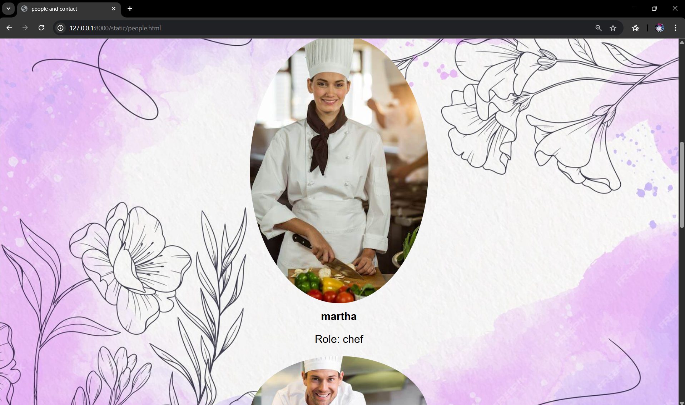

# Ex.07 Restaurant Website
## Date: 05/05/2025

## AIM:
To develop a static Restaurant website to display the food items and services provided by them.

## DESIGN STEPS:

### Step 1:
Requirement collection.

### Step 2:
Creating the layout using HTML and CSS.

### Step 3:
Updating the sample content.

### Step 4:
Choose the appropriate style and color scheme.

### Step 5:
Validate the layout in various browsers.

### Step 6:
Validate the HTML code.

### Step 7:
Publish the website in the given URL.

## PROGRAM:
```
HTML 
<!DOCTYPE html>
<html lang="en">
<head>
    <meta charset="UTF-8">
    <meta name="viewport" content="width=device-width, initial-scale=1.0">
    <title>restaurent</title>
    <link rel="stylesheet" href="style.css">
</head>
<body>
    <nav class="navbar">
        <div class="items"></div>
            <ul class="nav-links">
                <li><a href="home.html">home</a></li>
                <li><a href="menu.html">menu</a></li>
                <li><a href="people.html">people and contact</a></li>
            </ul>
        </div>
    </nav>
</body>
</html>
<!DOCTYPE html>
<html lang="en">
<head>
    <meta charset="UTF-8">
    <meta name="viewport" content="width=device-width, initial-scale=1.0">
    <title>home</title>
    <link rel="stylesheet" href="style.css">
</head>
<body>
    <a href="index.html" class="button">back</a>
    <h1>Welcome to Our Restaurant</h1>
    <p>Experience the best dining with us.</p>
    <p>We offer a variety of delicious dishes and drinks to satisfy your cravings.</p>
    <p>Delicious Food, Unforgettable Dining Experience"
    "Fresh ingredients, authentic flavors, and warm hospitality  all in one place."</p>
    
</body>
</html>
<!DOCTYPE html>
<html lang="en">
<head>
    <meta charset="UTF-8">
    <meta name="viewport" content="width=device-width, initial-scale=1.0">
    <title>menu</title>
    <link rel="stylesheet" href="style.css">
</head>
<body>
    <a href="index.html" class="button">back</a>
    <h2>Our Menu</h2>
                <p>Explore our delicious offerings.</p>
                <div class="menu-items">
                    <div class="menu-item">
                        
                        <h3>tea</h3>
                        <p>A warm cup of aromatic tea, perfect for cozy rainy days.</p>
                        <p>Price: rs15.00</p>
                    </div>
                    <div class="menu-item">
                        
                        <h3>coffee</h3>
                        <p>A rich and flavorful coffee to kickstart your day.</p>
                        <p>Price:rs 15.00</p>
                    </div>
                    <div class="menu-item">
                        
                        <h3>hot chocolate</h3>
                        <p>A creamy and indulgent hot chocolate, perfect for a sweet treat.</p>
                        <p>Price: rs 50.00</p>
                    </div>
                    <div class="menu-item">
                        
                        <h3>Falooda</h3>
                        <p>A refreshing and delightful dessert drink made with milk, rose syrup, and vermicelli.</p>
                        <p>Price: rs 50.00</p>
                    </div>
                    <div class="menu-item">
                        
                        <h3>mojito</h3>
                        <p>A refreshing minty drink with a hint of lime, perfect for hot days.</p>
                        <p>Price: rs 90.00</p>
                    </div>
                    <div class="menu-item">
                        
                        <h3>sandwich</h3>
                        <p>A delicious and wholesome sandwich filled with fresh ingredients, perfect for a quick bite.</p>
                        <p>Price: rs35.00</p>
                    </div>  
                    <div class="menu-item">
                        
                        <h3>Chicken wrap</h3>
                        <p>A flavorful chicken wrap with fresh veggies and sauces, perfect for a satisfying meal.</p>
                        <p>Price: rs 100.00</p>
                    </div>  
                    <div class="menu-item">
                        
                        <h3>momos</h3>
                        <p>A popular dumpling dish filled with vegetables or meat, served with a spicy dipping sauce.</p>
                        <p>Price: rs 35.00</p>
                    </div>
                    <div class="menu-item">
                        
                        <h3>noodles</h3>
                        <p>A delicious and savory noodle dish, perfect for a quick and satisfying meal.</p>
                        <p>Price: rs 90.00</p>
                    </div>
                    <div class="menu-item">
                        
                        <h3>pasta</h3>
                        <p>A creamy and flavorful pasta dish, perfect for pasta lovers.</p>
                        <p>Price: rs 100.00</p>
                    </div>
                    
</body>
</html>
<!DOCTYPE html>
<html lang="en">
<head>
    <meta charset="UTF-8">
    <meta name="viewport" content="width=device-width, initial-scale=1.0">
    <title>people and contact</title>
    <link rel="stylesheet" href="style.css">
</head>
<body>
    <a href="index.html" class="button">back</a>
<h2>People</h2>
                <p>Meet our team.</p>
                    <div class="person-item">
                        
                        <h3>Rick</h3>
                        <p>Role: manager</p>
                    </div>
                    <div class="person-item">
                        
                        <h3>mathew</h3>
                        <p>Role: chef</p>
                    </div>
                    <div class="person-item">
                        
                        <h3>martha</h3>
                        <p>Role: chef</p>
                    </div>
                    <div class="person-item">
                        
                        <h3>jonas</h3>
                        <p>Role: chef</p>
                    </div>
                    <div class="person-item">
                        
                        <h3>hannah</h3>
                        <p>Role: waiter</p>
                    </div>
                    <div class="person-item">
                        
                        <h3>silja</h3>
                        <p>Role: waiter</p>
                    </div>

                <h2>Contact Us</h2>
                <p>Get in touch with us.</p>
                <p>email: flavoris26@gmail.com</p>
                <p>phone: +91 9008007006</p>
</body>
</html>
```
```
CSS
nav{
    background-image: url('logo.jpg');
    background-repeat: no-repeat;
    background-size: 2000px ;
    background-position: center;
    height: 825px;
}
nav ul{
    list-style: none;
    padding: 0;
    margin: 0;
    display: flex;
    justify-content: center;
    align-items: center;
}
nav ul li{
    margin: 0 50px;
}
nav ul li a{
    text-decoration: none;
    color: whitesmoke;
    font-size: 30px;
    font-weight: bold;
}
nav ul li a:hover{
    color: #007BFF;
}
nav ul li a.active{
    color: #007BFF;
    text-decoration: underline;
}
nav ul li a.active:hover{
    text-decoration: none;
}
nav ul li a:visited{
    color: #ffffff;
}
nav ul li a:visited:hover{
    color: #007BFF;
}
body{
    background-image: url('home.jpg');
    background-repeat: no-repeat;
    background-size: cover;
    background-attachment: fixed;
    background-position: center;
    font-family: Arial, sans-serif;
    margin: 0;
    padding: 0;
}
h1{
    text-align: center;
    margin-top: 20px;
    color: #000000;
    font-size: 30px;
}
h2{
    text-align: center;
    margin-top: 20px;
    color: #000000;
    font-size: 30px;
}
h3{
    text-align: center;
    margin-top: 20px;
    color: #000000;
    font-size: 30px;
}
p{
    text-align: center;
    margin-top: 20px;
    color: #000000;
    font-size: 30px;
}
.center-image {
    display: block;
    margin: 0 auto;
}
img{
    border-radius: 50%;
}
a{

    text-align: left;
    text-decoration: none;
    color: #2e0c35;
    font-size: 25px;
    font-weight: bold;
}

```

## OUTPUT:





## RESULT:
The program for designing software company website using HTML and CSS is completed successfully.
